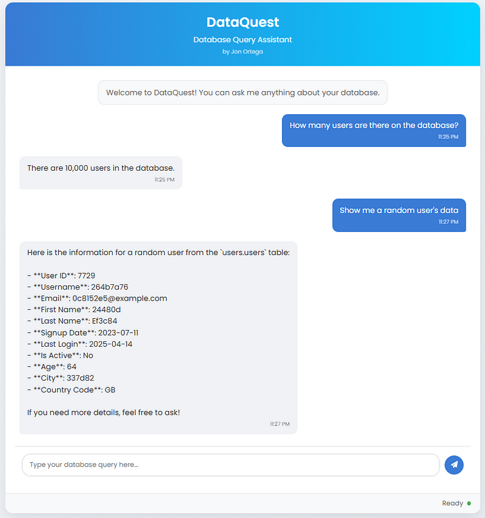

# DataQuest - Database Query Assistant

A chat-based interface for querying your database using natural language. Built with MCP (Model Context Protocol).



**Read the full article on Medium here: https://medium.com/@jonortega20/building-a-database-querier-with-mcp-17df0f49a2de**

## Features

- Clean, modern UI with responsive design
- Chat-style interface for natural language database queries
- Real-time interaction with your PostgreSQL database
- Supports code block formatting in responses
- Status indicators and loading animations

## Requirements

- Python 3.11+
- Flask
- LangChain OpenAI
- Postgre MCP

## Installation

1. Clone this repository

2. Install the required Python packages:

```bash
pip install flask flask-cors langchain_openai python-dotenv
```

3. Make sure you have MCP installed:

```bash
pip install mcp_use
```

4. Make sure you have an OpenAI API key and your database connection string in your .env file:

```
OPENAI_API_KEY=your_api_key_here
DB_LINK=your_database_connection_string_here
```

## Usage

1. Start the Flask server:

```bash
python app.py
```

2. Open your browser and navigate to:

```
http://localhost:5000
```

3. Start asking questions about your database!

## Example Queries

- "How many users are in the database?"
- "Show me a random user's information"
- "What is the average age of the users?"
- "What is the percentage of active users?"
- "How many users are there per country?"

## Created By

Jon Ortega 
